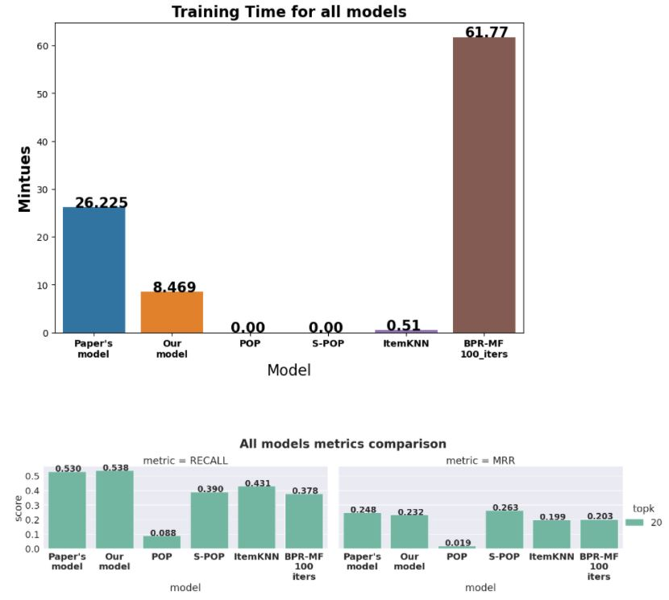

# Session based recommendations
In this repo we tackle the subject of Session based recommendations which relies on implicit feedbacks.
<br>We followed the paper [Session based recommendations wirh recurrent neural network](https://arxiv.org/pdf/1511.06939),<br>  recreated thinner dataset and the baselines presented in the paper,
and then engaged different GRU's to tackle the statement presented in paper about which GRU architecture yielded the highest evaluation scores.<br>
We supplied some graphical comparisons for out evaluated metrics: `Training time`,`Recall@20`,`MRR@20`.<br> we've shown both `training` and `validation loss` decreasing.<br>
We can say the least that each GRU architecture has shown magnificent improvement in `Recall@20`, and the rest you'll have to click [Session_based_recommendations.ipynb](https://github.com/gilzeevi25/Session_based_recommendations/blob/main/Session_based_recommendations.ipynb) and see for yourself


**this work has been made as part of a final project in a recommendation system course in Reichman University.<br>
the course was led by Dr Asi Messica and Sahar Millis.<br>
hence, the following materials were used solely for academical purposes, with no commercial intentions whatsoever.**
## References and copyrights
Our work is based and inspired from the authors of the GRU4REC  [paper](https://arxiv.org/pdf/1511.06939) and their git repo: https://github.com/hidasib/GRU4Rec.<br><br>
**For the GRU part which was implemented with pytorch, we cloned,revised and adapted relevent parts out of it, solely for academic purposes, from the work of Phạm Thanh Hùng(hungthanhpham94) and Younghun Song (yhs-968):**
- [Phạm Thanh Hùng(hungthanhpham94) repo](https://github.com/hungthanhpham94/GRU4REC-pytorch)
- [Younghun Song (yhs-968) repo](https://github.com/yhs968/pyGRU4REC)
## Dependencies
Watch [requirements.txt](https://github.com/gilzeevi25/Session_based_recommendations/blob/main/requirements.txt)
## Datasets
[RecSys Challenge 2015](https://www.kaggle.com/chadgostopp/recsys-challenge-2015?select=dataset-README.txt)
## Recreating our work
### Preprocessing
use [YOOCHOOSE_preprocessing.ipynb](https://github.com/gilzeevi25/Session_based_recommendations/blob/main/YOOCHOOSE_preprocessing.ipynb) and then apply one of the following options:
1. Creating the dataset used in paper:
  - Run the first 12 cells in order to create a full 6 months train set, where 2 of these days converted into test and validation<br> (each consists one day)<br><br>
**OR**<br>
2. Creating the thinner dataset we used:
  - Run the rest of cells, starting from cell #13 in order to create 4.5 train set, where 1 day out of it converted into test and validtion<br> (each consists one day)
### Training and plotting results
We've decided to create a notebook instead of the standard main.py in order to visualize the affect of different GRU's and present evaluations.
the structure is as follows:
```
├── YOOCHOOSE_preprocessing.ipynb
├── Session_based_recommendations.ipynb
│   ├── data
│   │    ├── test_samp.txt
│   │    ├── train_samp_tr.txt
│   │    ├── train_samp_valid.txt 
│   ├── lib
│   │    ├── dataset.py
│   │    ├── evaluation.py
│   │    ├── lossfunction.py 
│   │    ├── metric.py
│   │    ├── model.py
│   │    ├── optimizer.py
│   │    ├── trainer.py
```
- In order to recreate our results, devise a thinned dataset as instructed above, and then click [Session_based_recommendations.ipynb](https://github.com/gilzeevi25/Session_based_recommendations/blob/main/Session_based_recommendations.ipynb)
- the main notebook Session_based_recommendations.ipynb imports  modules from `lib\` which consists GRU components
- Please run cell by cell, unless you have strong CUDA resources.
- In order to train BPR-MF, we used 100 iterations (~ 1 hr, no multiprocessing)
- Stop before `Important note!` markdown as the following line wil exhaust strong GPU resources and will take many hours. We've splitted this cell into fragments and used several resources as google colab, Kaggle & local GPU.
- The hyperparameters search cell can be skipped as we provided for each inspected model the top-5 performed model out of the hyper-parameters. Hence, after skipping the big hyperparameter tuning cell, the rest of the notebook can be executed with no other precautions.<br><Br>

